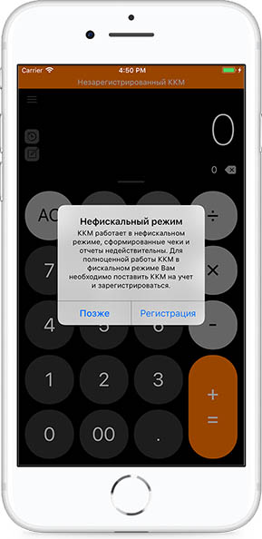
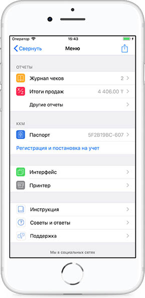
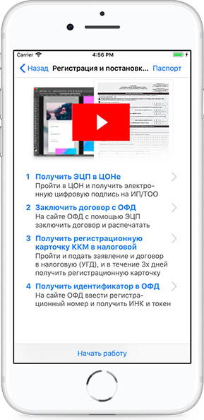
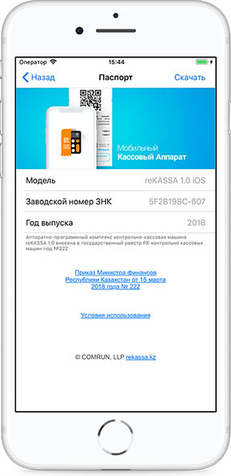
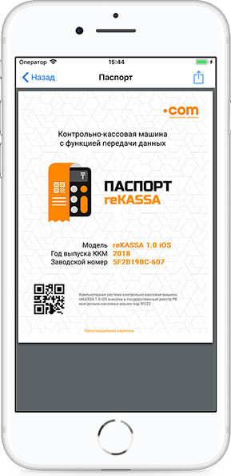
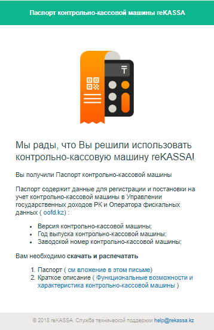
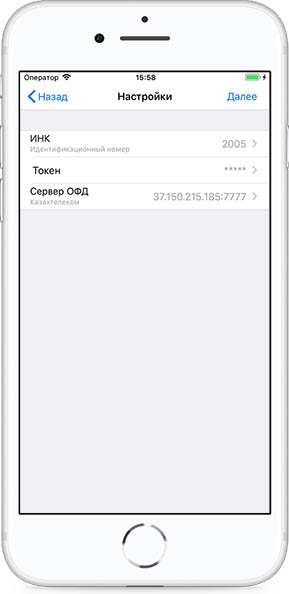
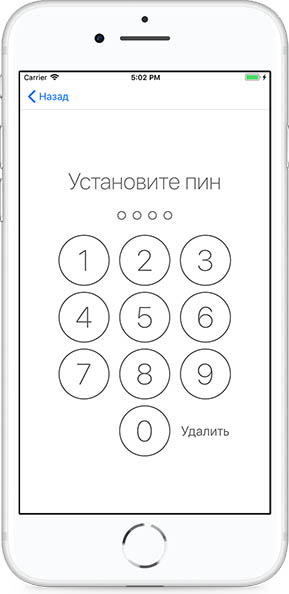

**Регистрация в KASSA mKKM**

Для регистрации в мобильном приложении KASSA mKKM необходимо на странице Калькулятор перейти в Меню.

В Меню выбрать раздел Регистрация и постановка на учет.

Страница Регистрация содержит инструкцию по постановке на учет и регистрации ККМ. Для получения сведений для регистрации ККМ в УГД необходимо перейти на страницу Паспорт.

На странице Паспорт можно увидеть Описание функциональных возможностей KASSA mKKM, также скачать документ.

Паспорт можно отправить на почту при помощи иконки на правом верхнем углу.

На почту приходит Паспорт в PDF формате в виде вложенного документа. Описание функциональных возможностей ККМ KASSA mKKM можно скачать по ссылке.

После скачивания Паспорта и Описания функциональных возможностей KASSA mKKM необходимо нажать на кнопку **Начать работу**.

Далее ввести ИНК \(ID\) и токен, который присудил ОФД. При возникновении ошибок "Неверный ID" и "Неверный токен" необходимо повторить действия.

Данные сервера ОФД заполнены автоматически, так как ККМ изначально с функцией передачи данных в ОФД.

Операции программирования \(конфигурирования\) подключения ККМ к серверу оператора фискальных данных и коррекции даты могут проводиться на ККМ только после завершения операции закрытия смены.

До этого момента проведение данных операций недоступно.

Нажать Далее после ввода ИНК и токена. После установить ПИН-код.

Данные организации подтягиваются автоматически с ОФД. ККМ успешно зарегистрирован.

При входе в раздел настройки, режим выполнения операции на калькуляторе и закрытие смены система запрашивает ПИН-код. Тем самым регистрационные данные для выполнения операции с чеком \(покупка, продажа, возвраты\), закрытие смены и программирование \(конфигурирование\) подключения ККМ к серверу ОФД защищены ПИН-кодом.

