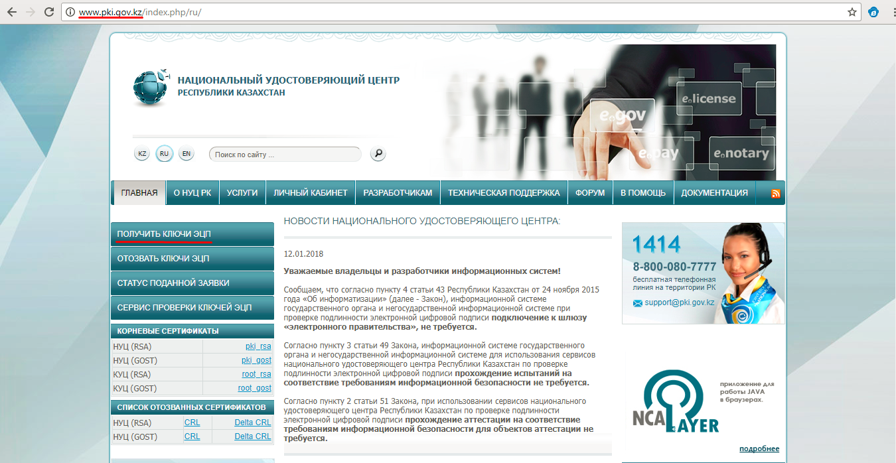

**Получение Электронной цифровой подписи**

Перед началом регистрации и постановки на учет контрольно-кассовую машину Вам необходимо получить ЭЦП на имя ИП/ТОО в Центре обслуживания населения. Оформление  заявки на получение ЭЦП доступно на сайте Национального удостоверяющего центра Республики Казахстан \(www.pki.gov.kz\). ЭЦП Вам необходим для регистрации и подписания Договора с Оператором фискальных данных. ЭЦП действует один год, после истечения срока нужно обновлять в Центре обслуживания населения.

