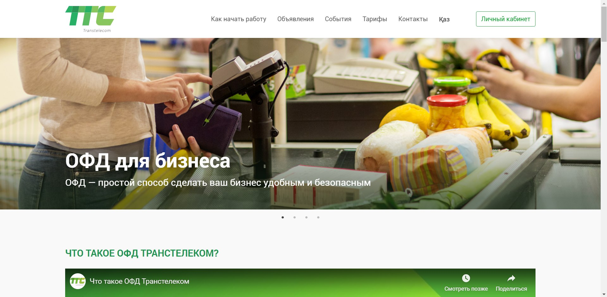
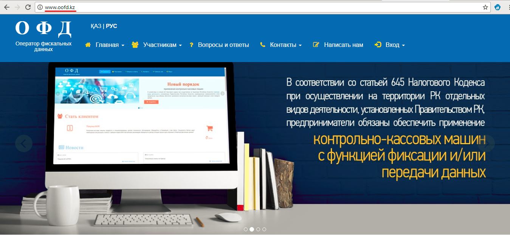
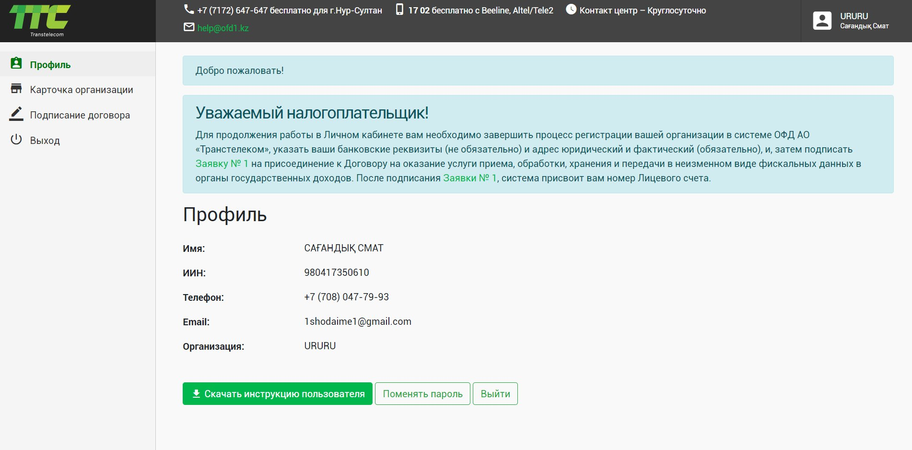
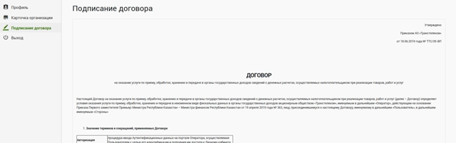
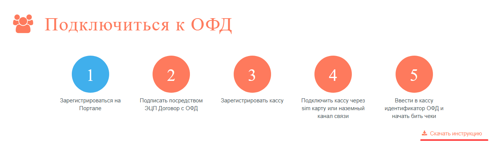

**Регистрация ИП/ТОО в ОФД**

После получения Электронной цифровой подписи Вам необходимо зарегистрироваться на сайте ОФД Транстелеком \([www.ofd1.kz](https://org.oofd.kz/#/landing)\).

Также вы можете зарегистрироваться на сайте ОФД Казахтелеком \([www.oofd.kz](https://org.oofd.kz/#/landing)\).

Описание всех действий на сайте ОФД Транстелеком доступно в инструкции пользователя.

Для регистрации ИП/ТОО на сайте ОФД Вам необходимо подписать Договор с ОФД при помощи ЭЦП.

Инструкция для ОФД Казахтелеком.

Для регистрации ИП/ТОО на сайте ОФД Вам необходимо подписать Договор с ОФД при помощи ЭЦП.

