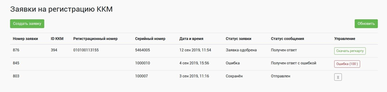
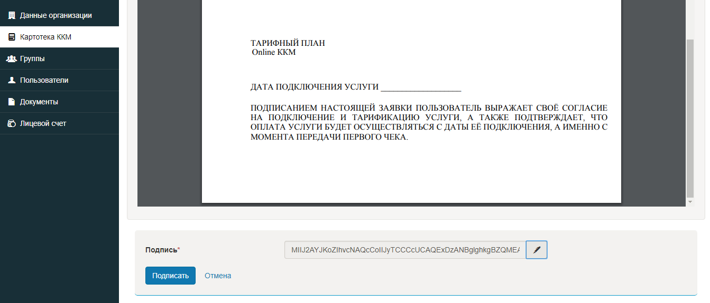

**Регистрация ККМ в ОФД**

* Для регистрации ККМ в ОФД Транстелеком, после подписания договора необходимо в личном кабинете перейти в раздел Организация и добавить адрес использования ККМ. После зайти в раздел Госуслуга и Заявка на Регистрацию ККМ. Создаете заявку и заполняете все необходимые поля.

   Подписать Заявку на подключение ККМ при помощи ЭЦП.

* Для регистрации ККМ в ОФД Казахтелеком необходимо в личном кабинете перейти в раздел Картотека ККМ и нажать на кнопку Зарегистрировать ККМ.Далее заполнить все запрашиваемые данные.

   Подписать Заявку на подключение ККМ при помощи ЭЦП.После этого ККМ будет зарегистрирован.

