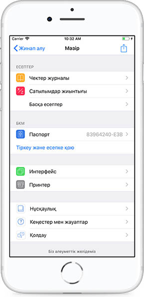

**KASSA mKKM-де тіркелу**

KASSA mKKM мобильді қосымшасында тіркелу үшін Калькулятор парақшасынан Мәзірге өту керек. Мәзірде Тіркеу және есепке қою тарауын таңдау керек.

Тіркеу парақшасында БКМ-н есепке қою және тіркеу туралы нұсқама бар. БКМ-н МКБ-да тіркеу туралы мәліметтерді алу үшін Паспорт парақшасына өту керек.

Паспорт парақшасында KASSA mKKM-нің функционалдық мүмкіндіктерінің сипаттамасын көруге болады, және де құжаттың өзін жүктеп алуға болады.

Паспортты жоғарғы оң жақ бұрышта тұрған белгіше көмегімен поштаға жіберуге болады.

Поштаға Паспорт PDF форматында, қыстырма құжат түрінде келеді. KASSA mKKM БКМ-ның функционалдық мүмкіндіктерінің сипаттамасын сілтеме бойынша жүктеп алуға болады.

KASSA mKKM Паспорты пен Функционалдық мүмкіндіктер сипаттамасы жүктеп алынғаннан кейін, **Жұмысты бастау **пернесіне басу керек.

Әрі қарай КЖН \(ID\) және ФДО берген токенді енгізу керек. "Қате ID" және "Қате токен" деген қателіктер шыққан жағдайда әрекеттерді қайталау керек.

ФДО сервер деректері автоматты түрде толтырылды, өйткені БКМ басынан ФДО-на деректерді тасымалдау функциясы бар. КЖН және токенді енгізгеннен кейін Әрі қарай пәрменін басу керек. Содан соң ПИН-кодты орнату керек.

Ұйым туралы деректер ФДО-нан автоматты түрде тартылады.

БКМ сәтті тіркелді.

