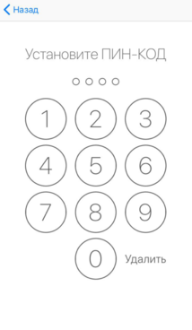
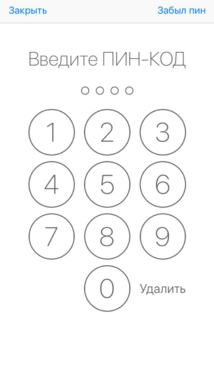
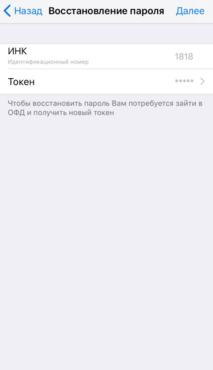

**Настройки ПИН-кода**

Для смениты ПИН-код необходимо перейти в раздел Сменить ПИН-код на странице Настройки. 

Устанавливаем новый ПИН-код.

Подтверждаем новый ПИН-код.

 ПИН-код успешно изменен.

**Восстановление ПИН-кода**

Если пользователь забыл пароль при входе в раздел Настройки, то в этом случаи необходимо нажать на Забыл ПИН.

 Далее откроется страница Восстановления ПИН-кода.

Для восстановления ПИН-кода необходимо ввести новый токен с личного кабинета ОФД. После этого установить новый пароль. 

