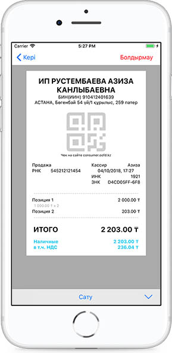
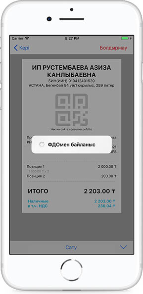
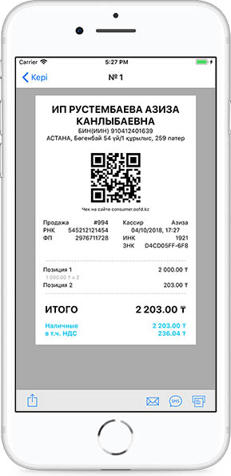
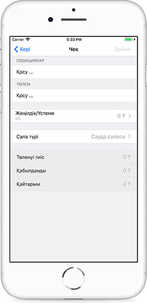
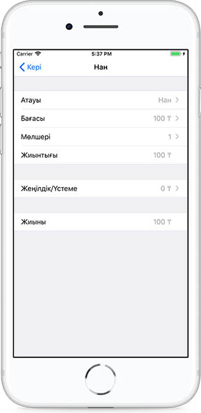
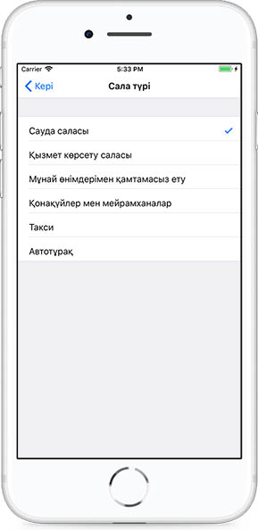
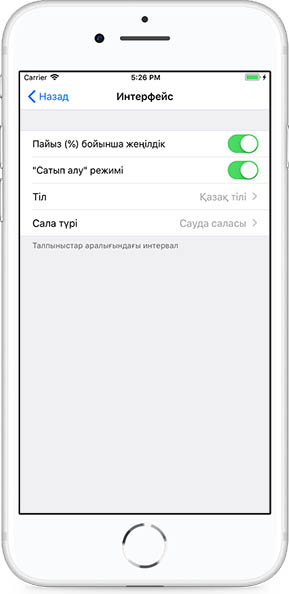

**Сату**

БКМ-да Сату операциясын рәсімдеудің екі әдісі бар:

1\) Калькуляторда позициялардың бағасын және сомасын көрсету керек.

Бағасы х мөлшері + бағасы х мөлшері + бағасы х мөлшері - жеңілдік мәні % = Жиынтық

Калькуляторда барлық позициялар үшін жалпы жеңілдік көрсетіледі.

 белгісін бірінші рет басқанда позициялардың қосындысы есептелінеді, екінші рет басқанда Жиын сомасы есептеледі, үшінші рет басқанда пречек рәсімделеді.

Әрі қарай операциялар түрлері тізімінен Сату таңдалуы керек.

Әрі қарай фискалды чек рәсімделеді.

2\) Позициялар егжей-тегжейіне өтіп операцияның барлық деректерін көрсету

Жеке позиция үшін жеңілдікті пайыз немесе сома түрінде көрсетуге болады.

Тумблер жеңілдіктен үстемеге немесе үстемеден жеңілдікке ауысуға мүмкіндік береді.

Жеке позиция үшін үстемені пайыз немесе сома түрінде көрсетуге болады.

Төлеудің 4 түрі бар, сондай-ақ аралас төлем түрін көрсетуге болады. Мысалы, қолма-қол ақша+банк картасы.

Сала түрін көрсетуге болады.

Ыңғайлы болу үшін Мәзірдегі Интерфейс тарауында сала түрі басынан көрсетіледі, осыдан кейін сала түрі чектің егжей-тегжейінде автоматты түрде сақталатын болады..

Осы әрекеттердің барлығынан кейін оң жақ жоғарғы бұрыштағы Дайын пәрменін басу керек, әрі қарай Операциялар түрлері тізімінен Сату операциясын таңдау керек.

Тауар сатылғанда, жұмыстар орындалғанда, қызмет көрсетілгенде алынатын ақша үшін чекке басып шығарылатын реквизиттер:

• Салық төлеушінің атауы \(ұйым, жеке кәсіпкер\)

• Салық төлеушінің ЖСН/БСН \(жеке сәйкестендіру нөмірі/бизнес сәйкестендіру нөмірі\);

• Құжат атауы – чек, реттік саны көрсетілген;

• Чек басылған күн;

• Чек басылған уақыт;

• Операция түрі \(Сату\);

• Тауар \(қызмет\) атауы, мөлшері \(салмақ\), тауар \(қызмет\) бірлігінің бағасы, тауар \(қызмет\) бағасы;

• Фискалдық деректер операторы серверінің рәсімдеген фискалды белгі нөмірі, чегінде «Фискалдық чек» сөз тіркесі басылған;

• ДТФ бар БКМ зауыттық нөмірі;

• ДТФ бар БКМ тіркеу нөмірі;

• ДТФ бар БКМ жеке нөмірі;

• Фискалдық деректер операторының атауы;

• Чектің шын екендігін тексеруге арналған фискалдық деректер операторының сайты.

