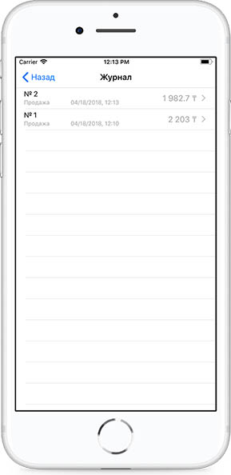
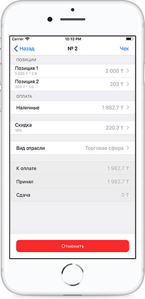
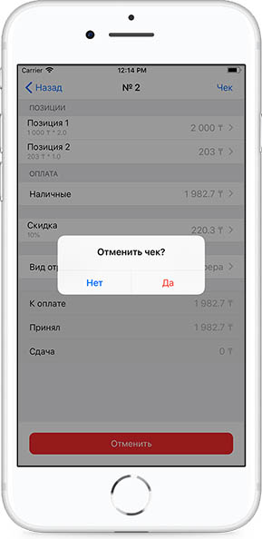
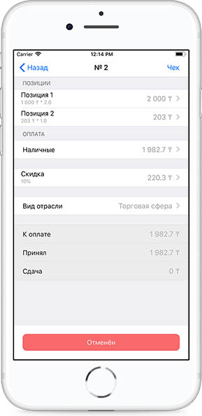

**Отмена последней транзакции **

В случаи обнаружения ошибок после фискализации чека есть возможность отменить последнюю транзакцию, для этого необходимо перейти в Журнал чеков.

Далее выбрать последний чек и нажать кнопку Отменить.

Отменять можно только последний чек. После отмены чек помечается как Отменён.

При отмене \(сторнировании\) чека все пункты при формировании чека отменяются.

