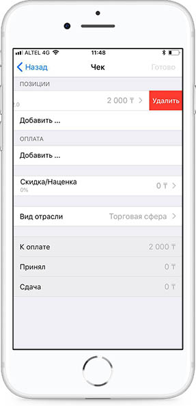

**Сторнирование позиции**

Если в случаи оформления деталей позиции возникли ошибки, есть возможность корректировать введенные данные, также полностью удалить позицию. Для этого необходимо перейти в детали позиции и в каждое поле ввести измененные данные. Для полного удаления позиции необходимо скользящим движением пальцев рук провести с лева на право по позиции, далее нажать на кнопку Удалить. Само действие называется Swype. 

При сторнировании позиции выполняются следующие операции.

* сторно товара/услуги;

* наименование сторно товара или услуги;

* код секции/отдела, для которого выполняется сторнирование;

* количество сторнируемого товара или услуги;

* цена сторнируемого товара или услуги;

* итоговая сумма сторно товара или услуги;

* налоги на сторно товара или услуги;

* сторно скидки/наценки на товар или услугу;

* наименование сторно скидки/наценки на товар или услугу;

* сумма сторно скидки/наценки на товар или услугу;

* налоги на сторно скидки/наценки на товар или услугу.

