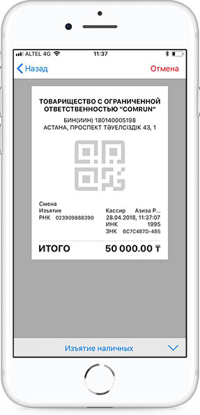
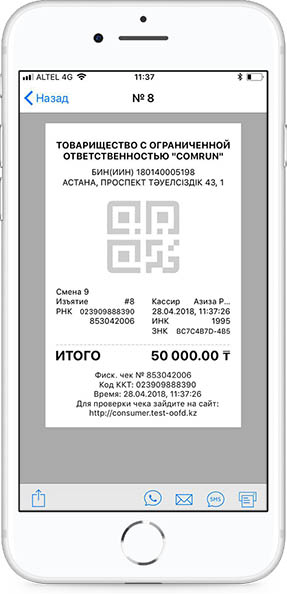

**Изъятие наличных**

Операция Изъятие наличных доступна двумя способами:

1\) Для проведения операций Изъятие наличных денежных средств из кассы необходимо на калькуляторе ввести сумму наличных денежных средств, сформировать чек и выбрать операцию «Изъятие наличных», далее нажать кнопку для передачи этой информации на сервер ОФД.

2\) Перейти в Детали позиции, в позициях указать сумму, выбрать операцию «Изъятие наличных», далее нажать кнопку для передачи этой информации на сервер ОФД.

Дождаться подтверждения от сервера ОФД информации о доступности наличных средств к изъятию. В случае, если наличных средств на указанную сумму недостаточно, то сервер ОФД передаст ответ с кодом ошибки.

При операции Изъятие наличных Скидка и Сдача не доступны. Если были проведены минусовые операций, то система выдаст ошибку. Необходимо указывать точную сумму.

