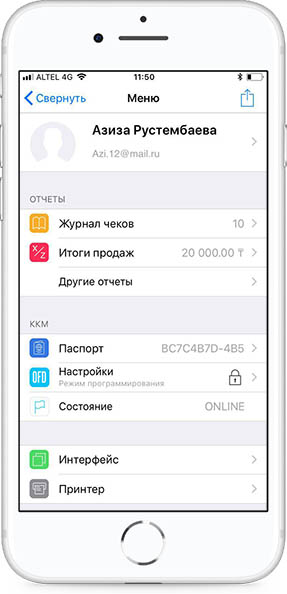
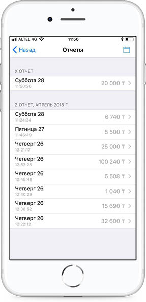

**Х-отчет \(сменный отчет без гашения\)**

Х-отчет передается на печать с сервера оператора фискальных данных по данному запросу ККМ с ФПД.

Для того чтобы увидеть Х-отчет необходимо провалиться в раздел Итоги продаж в Меню.

А разделе Итоги продаж можно увидеть X-отчет и Z-отчеты.

В календаре есть возможность выбрать период.

Отчетом можно поделиться также отправить на почту и распечатать.

Состав данных Х-отчета:

• Наименование налогоплательщика;

• ИИН/БИН налогоплательщика;

• Идентификационный номер ККМ с ФПД;

• Регистрационный номер ККМ с ФПД в органах налоговой службы;

• Заводской номер ККМ с ФПД в органах налоговой службы;

• Порядковый номер документа;

• Дата и время выполнения Х-отчета;

• Название документа «Х-отчет»;

• Общее число документов, сформированных ККМ с ФПД в течение смены;

• Раздел «Продажа»:

• Общее число контрольных чеков, сформированных ККМ с ФПД в течение смены;

• Общее число контрольных чеков, оплаченных наличностью;

• Общее число контрольных чеков, оплаченных платежными банковскими картами;

• Общая сумма контрольных чеков, выданных ККМ с ФПД в течение смены;

• Общая сумма оплаты наличными по всем чекам за смену;

• Общая сумма оплаты платежными банковскими картами по всем чекам за смену;

• Общая полученная сумма оплаты по всем чекам за смену;

• Общая сумма сдачи после оплаты по всем чекам за смену;

• Общая сумма скидки на сумму по всем чекам за смену;

• Общая сумма наценки на сумму по всем чекам за смену;

• Раздел «Возврат»:

• Общее число возвратов, сформированных ККМ с ФПД в течение смены;

• Общая сумма возвратов, сформированных ККМ с ФПД в течение смены;

• Раздел «Налоги»:

• Общая сумма НДС по всем чекам за смену;

• Код оператора-кассира, проводившего процедуру снятия Х- отчета.

