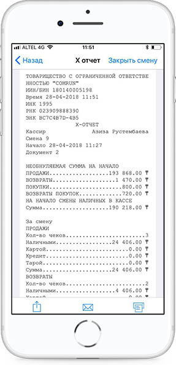
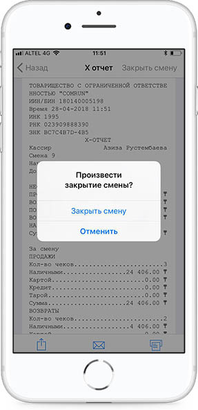
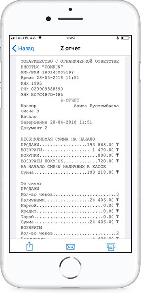

**Сменный Z-отчет с гашением**

Z-отчет** **формируется после закрытия смены. Для закрытия смены проваливаемся в X-отчет и на правом верхнем углу нажимаем Закрыть смену.

Подтверждаем действие.

После закрытия смены сервер ОФД присылает сформированный для печати Z-отчет.

Отчетом можно поделиться либо отправить на почту и распечатать.

Z-отчеты можно просмотреть за весь период либо за определенную дату.

Состав данных Z-отчета:

• Наименование налогоплательщика;

• ИИН/БИН налогоплательщика;

• Идентификационный номер ККМ с ФПД;

• Регистрационный номер ККМ с ФПД в органах налоговой службы;

• Заводской номер ККМ с ФПД;

• Порядковый номер документа;

• Дата и время выполнения Z-отчета;

• Название документа «Z-отчет»;

• Дата и время начала смены;

• Дата и время завершения смены;

• Общее число документов, сформированных ККМ с ФПД в течение смены;

• Раздел «Продажа»:

• Общее число контрольных чеков, сформированных ККМ с ФПД в течение смены;

• Общее число контрольных чеков, оплаченных наличностью;

• Общее число контрольных чеков, оплаченных платежными банковскими картами;

• Общая сумма контрольных чеков, выданных ККМ с ФПД в течение смены;

• Общая полученная сумма оплаты по всем чекам за смену;

• Общая сумма сдачи после оплаты по всем чекам за смену;

• Общая сумма оплаты наличными по всем чекам за смену;

• Общая сумма оплаты платежными банковскими картами по всем чекам за смену;

• Общая сумма скидки на сумму по всем чекам за смену;

• Общая сумма наценки на сумму по всем чекам за смену;

• Раздел «Возврат»:

• Общее число возвратов, сформированных ККМ с ФПД в течение смены;

• Общая сумма возвратов, сформированных ККМ с ФПД в течение смены;

• Раздел «Налоги»:

• Общая сумма НДС по всем чекам за смену;

• Контрольная сумма Z-отчета;

• Код оператора-кассира, проводившего процедуру снятия Z- отчета.

