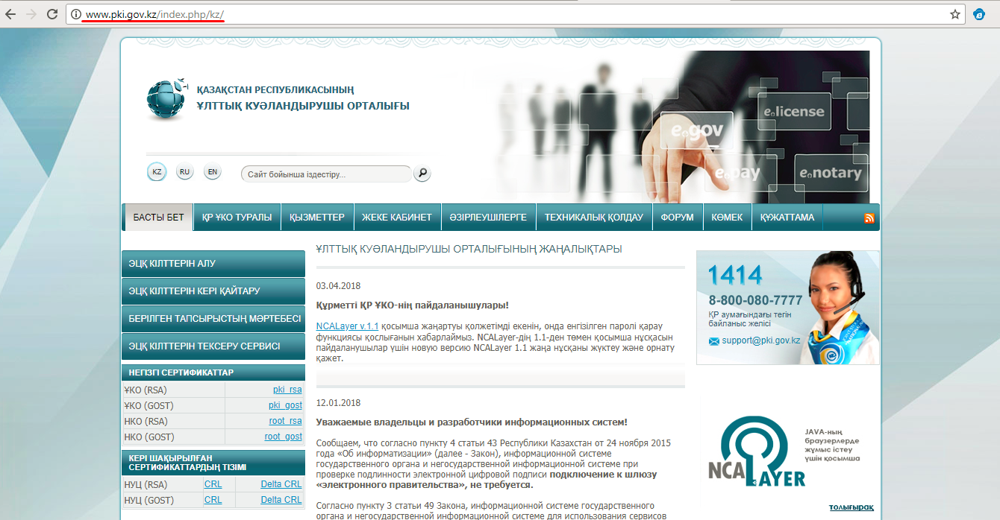

**Электрондық цифрлық қолтаңбаны алу**

Бақылау-кассалық машинаны тіркеуден және есепке қоярдан бұрын, Сізге Халыққа қызмет көрсету орталығынан ЖК/ЖШС атына ЭЦҚ алу керек. ЭЦҚ алу үшін өтінішті Қазақстан Республикасының Ұлттық куәландырушы орталығы сайтына \(www.pki.gov.kz\) рәсімдеуге болады. ЭЦҚ Сізге Фискалды деректер операторымен Келісім-шартты тіркеу және қол қою үшін қажет болады. ЭЦҚ бір жылға жарамды, жарамдылық мерзімі аяқталған кезде оны Халыққа қызмет көрсету орталығынан жаңартып тұру керек.

