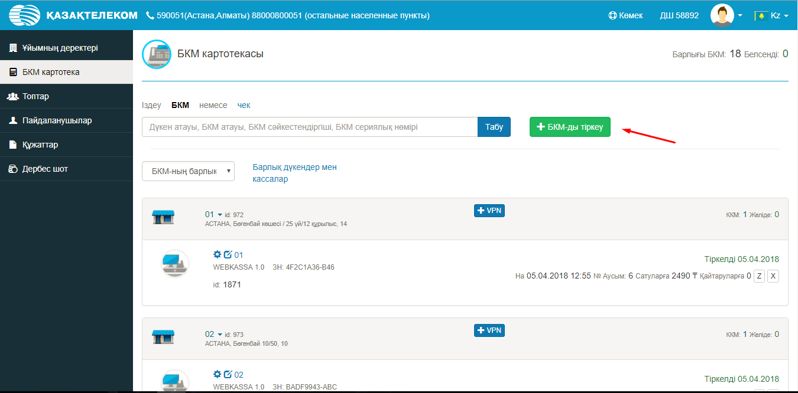
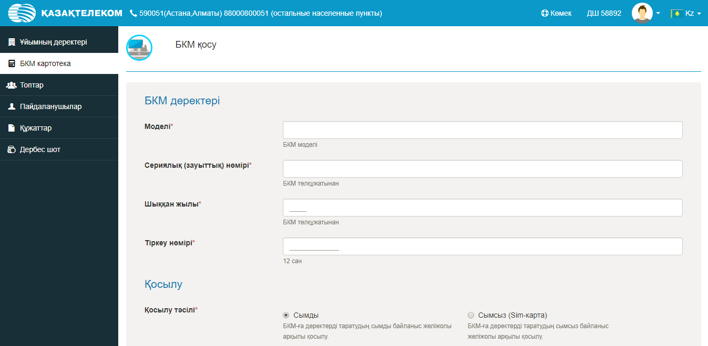
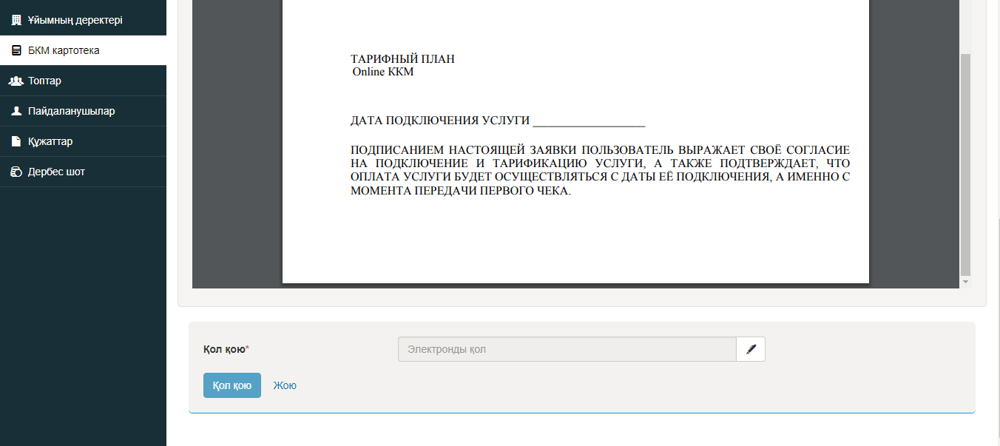

**БКМ-ны ФДО-да тіркеу**

БКМ-ны ФДО-да тіркеу үшін, жеке кабинеттегі БКМ картотекасы тарауына өтіп, БКМ тіркеу пернесіне басу керек.

Одан әрі барлық сұралатын деректерді толтыру керек.

БКМ-ны қосу үшін Өтінімге ЭЦҚ көмегімен қол қою керек.

Осыдан кейін БКМ тіркеуге тұрады.

