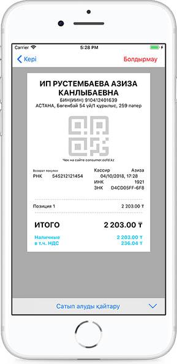
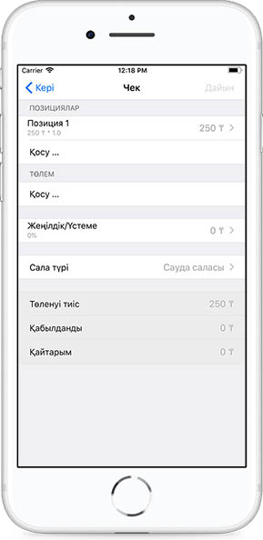

**Сатып алғанды кері қайтару**

БКМ-да Сатып алғанды кері қайтару операциясын рәсімдеудің екі әдісі бар:

1\) Калькуляторда позициялардың бағасын және сомасын көрсету керек.

Бағасы х мөлшері + бағасы х мөлшері + бағасы х мөлшері - жеңілдік мәні % = Жиынтық

Калькуляторда барлық позициялар үшін жалпы жеңілдік көрсетіледі.

 белгісін бірінші рет басқанда Жиынтық сома есептеледі, екінші рет басқанда пречек рәсімделеді. Әрі қарай операциялар түрлері тізімінен Сатып алғанды кері қайтару таңдалуы керек.

2\) Позициялар егжей-тегжейіне өтіп, барлық деректерді көрсету керек. Осы әрекеттерден кейін операциялар түрлері тізімінен Сатып алғанды кері қайтару операциясын таңдау керек.

Тауар сатылғанда, жұмыстар орындалғанда, қызмет көрсетілгенде алынатын ақша үшін чекке басып шығарылатын реквизиттер:

• Салық төлеушінің атауы \(ұйым, жеке кәсіпкер\)

• Салық төлеушінің ЖСН/БСН \(жеке сәйкестендіру нөмірі/бизнес сәйкестендіру нөмірі\);

• Құжат атауы – чек, реттік саны көрсетілген;

• Чек басылған күн;

• Чек басылған уақыт;

• Операция түрі \(Сатып алғанды кері қайтару\);

• Тауар \(қызмет\) атауы, мөлшері \(салмақ\), тауар \(қызмет\) бірлігінің бағасы, тауар \(қызмет\) бағасы;

• Фискалдық деректер операторы серверінің рәсімдеген фискалды белгі нөмірі, чегінде «Фискалдық чек» сөз тіркесі басылған;

• ДТФ бар БКМ зауыттық нөмірі;

• ДТФ бар БКМ тіркеу нөмірі;

• ДТФ бар БКМ жеке нөмірі;

• Фискалдық деректер операторының атауы;

• Чектің шын екендігін тексеруге арналған фискалдық деректер операторының сайты.

