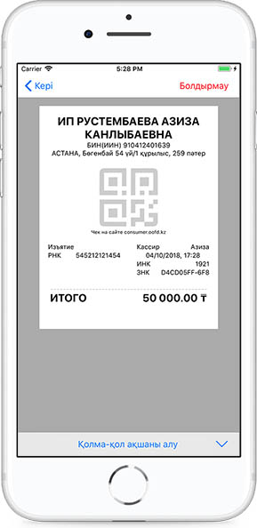

**Қолма-қол ақшаны алып алу**

Қолма-қол ақшаны алып алу операциясы екі әдіспен іске асырыла алады:

1\) Кассаға қолма-қол ақша енгізу операциясын жүргізу үшін калькуляторда қолма-қол енгізілетін ақшаның сомасын енгізу керек, чек жасап "Қолма-қол ақшаны алып алу" операциясын таңдау керек, одан әрі ақпаратты ФДО серверіне жіберу үшін тиісті пернені басу керек.  белгісін бірінші рет басқан кезде Жалпы сома есептеледі, екінші рет басқанда пречек құрылады. Содан кейін операциялар түрлері тізімінен Қолма-қол ақшаны алып алуды таңдау керек.

2\) Позицияның егжей-тегжейіне өтіңіз, позицияларда соманы көрсету, «Қолма-қол ақшаны алып алу» операциясын таңдау, одан кейін осы ақпаратты ФДО серверіне жеткізу үшін пернені басу.

Қолма-қол ақшаны алып алу операциясын орындаған кезде Жеңілдік пен Қайтарым қолжетімді емес. Егер минустық операциялар жүргізілген болса, онда жүйе қателік көрсетеді. Нақты соманы көрсету керек.

