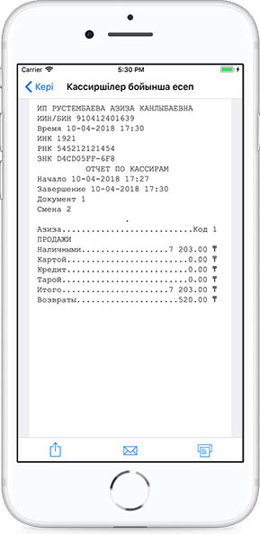

**Кассирлар бойынша есептеме**

Кассирлар бойынша есептемені көру үшін Мәзірдегі Басқа есептемелер тарауына өту керек.

Кассирлар бойынша есептеме ауысым сайын құралып тұрады. Күнтізбеден барлық кезең немесе белгілі бір күн үшін есептемелерді таңдап алуға болады.

Есептемені бөлісуге немесе поштаға жіберіп, басып шығаруға болады. Кассирлер бойынша есептеме - бір кассир жұмыс істеген уақыттағы операциялар түрлері және төлем әдісі бойынша болатын ақпаратты қамтиды.

