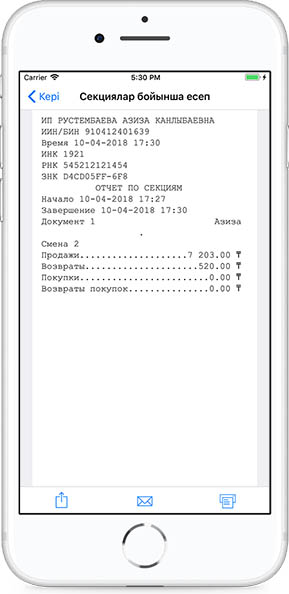

**Секциялар бойынша есептеме **

Секциялар бойынша есептемені көру үшін Мәзірдегі Басқа есептемелер тарауына өту керек.

Секциялар бойынша есептемелер ауысым сайын құрылады.

Күнтізбеден барлық кезең немесе белгілі бір күн үшін есептемелерді таңдап алуға болады.

Есептемені бөлісуге немесе поштаға жіберіп, басып шығаруға болады. Секциялар бойынша есептеме - бір секция шеңберіндегі операциялар түрлері бойынша ақпаратты қамтиды.

