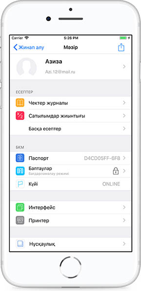
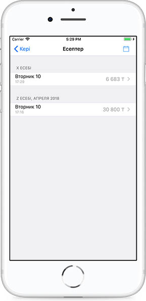
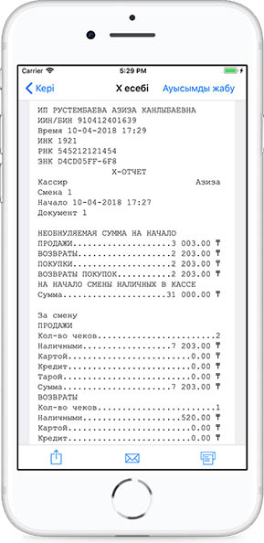

**Х-есептеме \(өтеусіз ауысымдық есептеме\)**

Х-есептемені көру үшін мәзірдегі Сатылымдар қорытындысы тарауына өту керек.

Сатылымдар қорытындысы тарауында X-есептемесін және Z-есептемесін көруге болады.

Есептемені бөлісуге немесе поштаға жіберіп, басып шығаруға болады.

Х-есептеме деректерінің құрамы:

• Салық төлеушінің атауы;

• Салық төлеушінің ЖСН/БСН;

• ДТФ бар БКМ сәйкестендіру нөмірі;

• Салық қызметі органдарындағы ДТФ бар БКМ-ның тіркеу нөмірі;

• Салық қызметі органдарындағы ДТФ бар БКМ-ның зауыттық нөмірі;

• Құжаттың реттік нөмірі;

• Х-есептемені орындау күні мен уақыты;

• Құжат атауы «Х-есептеме»;

• Ауысым бойынша ДТФ бар БКМ-ның рәсімдеген құжаттардың жалпы саны;

• «Сату» тарауы:

• Ауысым бойынша ДТФ бар БКМ-ның рәсімдеген бақылау чектерінің жалпы саны;

• Қолма-қол ақшамен төленген бақылау чектерінің жалпы саны;

• Банк төлем карталарымен төленген бақылау чектерінің жалпы саны;

• Ауысым бойынша ДТФ бар БКМ-ның шығарған бақылау чектерінің жалпы сомасы;

• Ауысым бойынша барлық чектер үшін қолма-қол ақшамен төленген жалпы сома;

• Ауысым бойынша барлық чектер үшін банк төлем карталарымен төленген жалпы сома;

• Ауысым бойынша барлық төленген чектер үшін алынған жалпы сома;

• Ауысым бойынша барлық чектер төленген соң берілген қайтарым ақшаның жалпы сомасы;

• Ауысым бойынша барлық чектер сомасына берілетін жалпы жеңілдік сомасы;

• Ауысым бойынша барлық чектер сомасына келетін үстеменің жалпы сомасы;

• «Қайтарым» тарауы:

• Ауысым бойынша ДТФ бар БКМ-ның рәсімдеген қайтарымдардың жалпы саны;

• Ауысым бойынша ДТФ бар БКМ-ның рәсімдеген қайтарымдардың жалпы сомасы;

• «Салықтар» тарауы:

• Ауысым бойынша барлық чектерге келетін ҚҚС жалпы сомасы;

• Х-есептемесін алу рәсімін жүргізген оператор-кассирдің коды.

