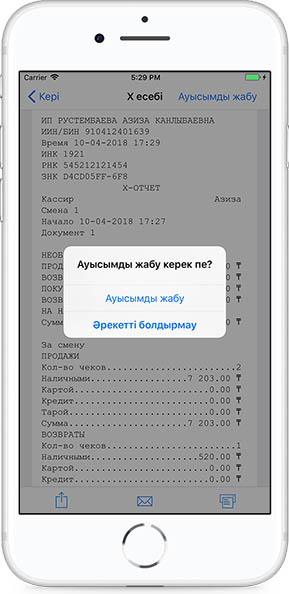
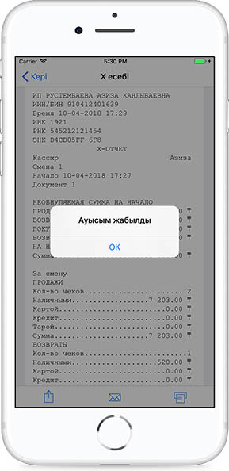
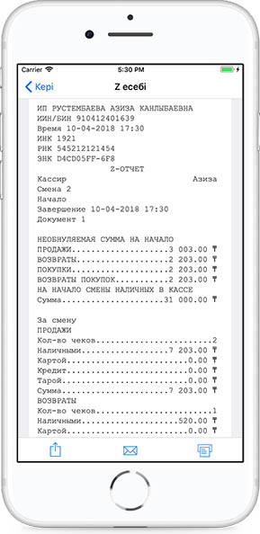

**Ауысымдық өтеумен берілетін Z-есептеме**

Z-есептеме ауысым жабылған соң құралады. Ауысымды жабу үшін Х-есептемесіне өтеміз де, оң жақ жоғарғы бұрыштағы Ауысымды жабу деген жерді басамыз.

Әрекетті растаймыз.

Ауысым жабылғаннан кейін ФДО сервері басып шығаруға дайын Z-есептемесін әкеліп береді.

Есептемені бөлісуге немесе поштаға жіберіп, басып шығаруға болады.

Z-есептемелерді барлық кезең немесе белгілі бір күн үшін көріп шығуға болады.

Z-есептеме деректерінің құрамы:

• Салық төлеушінің атауы;

• Салық төлеушінің ЖСН/БСН;

• ДТФ бар БКМ сәйкестендіру нөмірі;

• Салық қызметі органдарындағы ДТФ бар БКМ-ның тіркеу нөмірі;

• ДТФ бар БКМ зауыттық нөмірі;

• Құжаттың реттік нөмірі;

• Z-есептемені орындау күні мен уақыты;

• Құжат атауы «Z-есептеме»;

• Ауысым басталу күні мен уақыты;

• Ауысым аяқталу күні мен уақыты;

• Ауысым бойынша ДТФ бар БКМ-ның рәсімдеген құжаттарының жалпы саны;

• «Сату» тарауы:

• Ауысым бойынша ДТФ бар БКМ-ның рәсімдеген бақылау чектерінің жалпы саны;

• Қолма-қол ақшамен төленген бақылау чектерінің жалпы саны;

• Ауысым бойынша барлық чектер үшін банк төлем карталарымен төленген жалпы сома;

• Ауысым бойынша ДТФ бар БКМ-ның рәсімдеген бақылау чектерінің жалпы сомасы;

• Ауысым бойынша барлық төленген чектер үшін алынған жалпы сома;

• Ауысым бойынша барлық чектер төленген соң берілген қайтарым ақшаның жалпы сомасы;

• Ауысым бойынша барлық чектер үшін қолма-қол ақшамен төленген жалпы сома;

• Ауысым бойынша барлық чектер үшін банк төлем карталарымен төленген жалпы сома;

• Ауысым бойынша барлық чектер сомасына берілетін жалпы жеңілдік сомасы;

• Ауысым бойынша барлық чектер сомасына келетін үстеменің жалпы сомасы;

• «Қайтарым» тарауы:

• Ауысым бойынша ДТФ бар БКМ-ның рәсімдеген қайтарымдардың жалпы саны;

• Ауысым бойынша ДТФ бар БКМ-ның рәсімдеген қайтарымдардың жалпы сомасы;

• «Салықтар» тарауы:

• Ауысым бойынша барлық чектерге келетін ҚҚС жалпы сомасы;

• Z-есептеменің бақылау сомасы;

• Z-есептемесін алу рәсімін жүргізген оператор-кассирдің коды.

