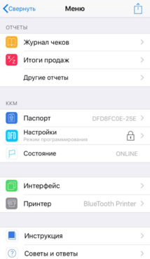
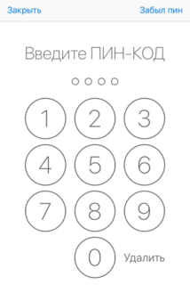
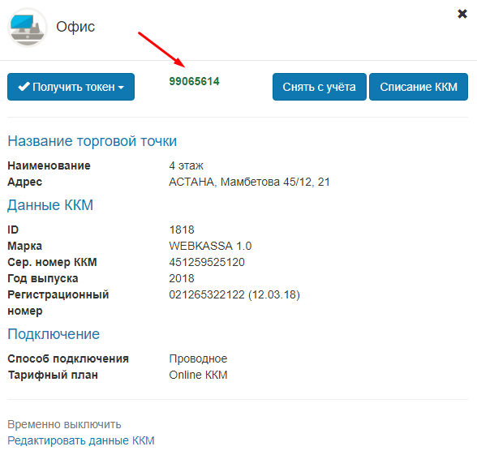
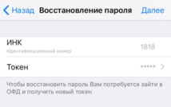
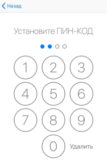
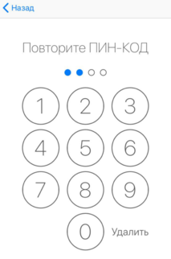

**Восстановление пароля**

Если пользователь забыл пароль при входе в раздел Настройки Меню, то есть возможность восстановления пароля. Для этого необходимо нажать на правом верхнем углу на Забыл пин.

Открывается страница Восстановления пароля. Чтобы восстановить пароль необходимо ввести новый токен с сайта ОФД. 

После нажать на кнопку Далее и установить новый ПИН-код.

Пароль успешно восстановлен.

