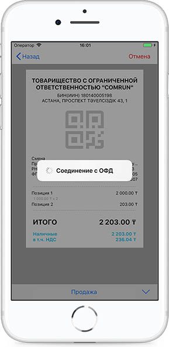

**Продажа**

В ККМ есть два способа оформить операцию Продажа:

1\) Необходимо указать сумму и стоимость позиций на калькуляторе.

Стоимость х количество + стоимость х количество + стоимость х количество - значение  скидки % = Итог

На калькуляторе указывается общая скидка на все позиций. 

При первом нажатии знака  позиции суммируются, при втором нажатии исчисляется Итоговая сумма, при третьем нажатии формируется пречек. На калькуляторе указывается общая скидка на все позиции.

Далее необходимо выбрать Продажа из списка видов операций.

Далее формируется фискальный чек.

2\) Провалиться в детали позиций и указать все данные операции

Скидку на отдельную позицию можно указать в виде процента или в виде суммы.

Тумблер позволяет переключиться со скидки на наценку и обратно.

Наценку на отдельную позицию можно указать в виде процента или в виде суммы.

Есть 4 вида оплаты, также можно указать смешанный Вид оплаты. Например, Наличные+Банковской картой.

Можно указать Вид отрасли.

Вид отрасли для удобства изначально указывается в Меню в разделе Интерфейс, после этого Вид отрасли в деталях чека сохранится автоматически.

НДС и Вид налогооблажения можно указать на странице Настройки.

В разделе Интерфейс есть возможность включить Скидку в процентах, поменять язык на Казахский, включить режим Покупка.

После всех этих действий необходимо нажать кнопку Готово на правом верхнем углу, далее выбрать Вид операций Продажа из списка видов операций.

Реквизиты, печатаемые на чеке при приеме денежных средств в случае продажи товаров, выполнения работ, оказания услуг:

• Наименование налогоплательщика \(организации, индивидуального предпринимателя\)

• ИИН/БИН \(индивидуальный идентификационный номер/бизнес идентификационный номер\) налогоплательщика;

• Наименование документа – чек, с указанием порядкового номера;

• Дата печати чека;

• Время печати чека;

• Вид операции \(Продажа\);

• Наименование товара \(услуги\), количество \(вес\), цена единицы товара \(услуги\), стоимость товара \(услуги\);

• Номер фискального признака, сформированного сервером оператора фискальных данных с отражением на чеке словосочетания «Фискальный чек»;

• ЗНК ККМ с ФПД;

• РНК ККМ с ФПД;

• ИНК ККМ с ФПД;

• Наименование оператора фискальных данных;

• Сайт оператора фискальных данных для проверки подлинности чека.

Чек необходимо обязательно распечатать либо выслать предоставленными средствами, в противном случаи система не даст продолжить дальнейшие действия.

После отправки и распечатки чека в нём будет указано Дубликат.

