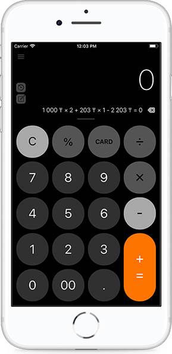

**Возврат продажи**

В ККМ есть два способа оформить операцию Возврат продажи:

1\) Необходимо указать сумму и стоимость позиций на калькуляторе.

Стоимость х количество + стоимость х количество + стоимость х количество - значение  скидки % = Итог

При первом нажатии знака  позиции суммируются, при втором нажатии исчисляется Итоговая сумма, при третьем нажатии формируется пречек.

Далее необходимо выбрать Возврат из списка видов операций.

2\) Провалиться в детали позиций и указать все данные, после этих действий выбрать вид операций Возврат продажи из списка видов операций.

Реквизиты, печатаемые на чеке при приеме денежных средств в случае Возврата продажи товаров, выполнения работ, оказания услуг:

• Наименование налогоплательщика \(организации, индивидуального предпринимателя\)

• ИИН/БИН \(индивидуальный идентификационный номер/бизнес идентификационный номер\) налогоплательщика;

• Наименование документа – чек, с указанием порядкового номера;

• Дата печати чека;

• Время печати чека;

• Вид операции \(Возврат\);

• Наименование товара \(услуги\), количество \(вес\), цена единицы товара \(услуги\), стоимость товара \(услуги\);

• Номер фискального признака, сформированного сервером оператора фискальных данных с отражением на чеке словосочетания «Фискальный чек»;

• ЗНК ККМ с ФПД;

• РНК ККМ с ФПД;

• ИНК ККМ с ФПД;

• Наименование оператора фискальных данных;

• Сайт оператора фискальных данных для проверки подлинности чека.

