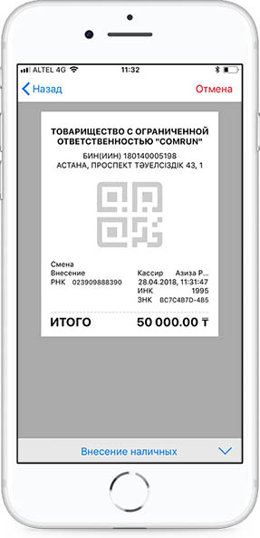
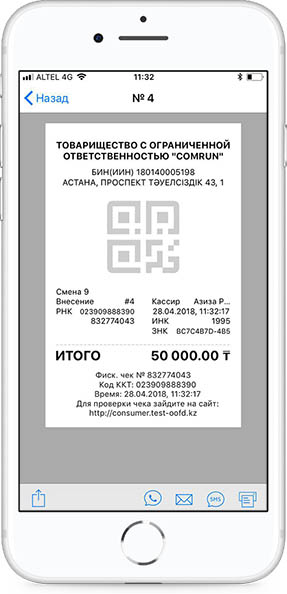

**Внесение наличных**

Операция Внесение наличных доступна двумя способами:

1\) Для проведения операций внесения наличных денежных средств в кассу необходимо на калькуляторе ввести сумму наличных денежных средств, сформировать чек и выбрать операцию «Внесение наличных», далее нажать кнопку для передачи этой информации на сервер ОФД.

При первом нажатии знака  позиции суммируются, при втором нажатии исчисляется Итоговая сумма, при третьем нажатии формируется пречек. Далее необходимо выбрать Внесение наличных из списка видов операций.

2\) Перейти в Детали позиции, в позициях указать сумму, выбрать операцию «Внесение наличных», далее нажать кнопку для передачи этой информации на сервер ОФД.

При операции Внесение наличных Скидка и Сдача не доступны. Если были проведены минусовые операций, то система выдаст ошибку. Необходимо указывать точную сумму.

